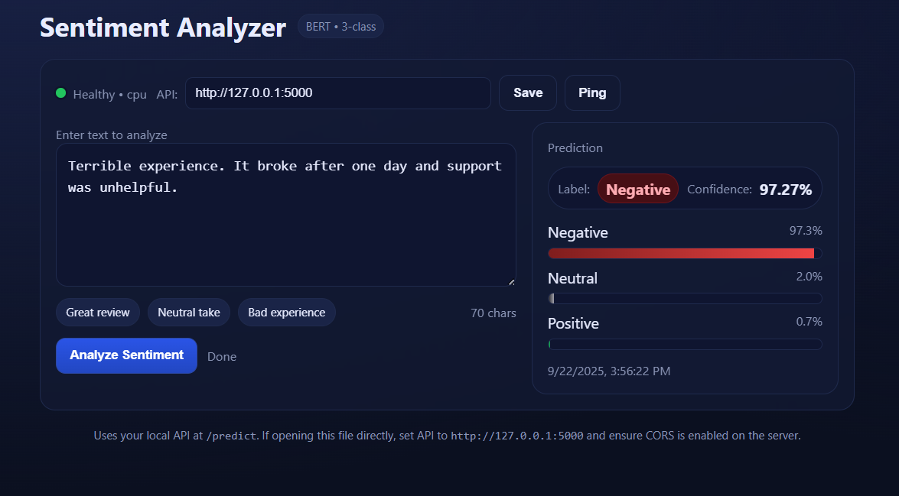

# 🎭 Sentiment Analyzer

A state-of-the-art sentiment analysis system powered by BERT transformers, providing high-accuracy text sentiment classification through both a web API and an elegant frontend interface.




## ✨ Features

### 🤖 **Advanced NLP Model**

- **BERT Transformer Architecture**: Fine-tuned BERT-base-uncased model for superior context understanding
- **3-Class Classification**: Precise sentiment detection (Positive, Neutral, Negative)
- **High Accuracy**: Trained on curated sentiment datasets with robust preprocessing
- **GPU/CPU Support**: Automatic device detection for optimal performance

### 🚀 **REST API**

- **Flask-powered Backend**: Scalable and production-ready API server
- **Multiple Endpoints**: Single prediction, batch processing, and health monitoring
- **CORS Enabled**: Ready for cross-origin requests and web integration
- **Confidence Scores**: Detailed probability distributions for all sentiment classes
- **Error Handling**: Comprehensive error responses and logging

### 🎨 **Modern Web Interface**

- **Real-time Analysis**: Instant sentiment prediction with visual feedback
- **Responsive Design**: Beautiful dark theme with mobile-first approach
- **Interactive Charts**: Dynamic confidence score visualization
- **Sample Texts**: Quick-start examples for different sentiment types
- **API Status Monitoring**: Live connection status and health checks

### 🔧 **Developer-Friendly**

- **Easy Integration**: Simple REST API for any application
- **Batch Processing**: Analyze multiple texts in a single request
- **Detailed Responses**: Timestamps, confidence scores, and metadata
- **Local Development**: Run entirely offline without external dependencies

## 🏗️ Architecture

```
Sentiment_Analyzer/
├── Model_Creation/              # Training pipeline
│   ├── model_creator.ipynb     # BERT fine-tuning notebook
│   ├── Dataset/                # Training data
│   └── saved_models/           # Trained model artifacts
│       └── bert-sentiment/     # Fine-tuned BERT model
└── Sentiment_Analyzer_System/  # Production system
    ├── api/                    # Flask REST API
    │   ├── app.py             # Main API server
    │   ├── requirements.txt   # Dependencies
    │   └── model/             # Model files
    └── frontend/              # Web interface
        └── index.html         # Single-page application
```

## 🚀 Quick Start

### Prerequisites

- Python 3.8+
- Virtual environment (recommended)
- 4GB+ RAM for model loading

### 1. Clone and Setup

```bash
git clone https://github.com/sulavghimiree/Sentiment_Analyzer_Using_BERT_Transformers
cd Sentiment_Analyzer
```

### 2. Install Dependencies

```bash
cd Sentiment_Analyzer_System/api
pip install -r requirements.txt
```

### 3. Start the API Server

```bash
python app.py
```

The API will start on `http://localhost:5000`

### 4. Access the Web Interface

Open `frontend/index.html` in your browser or serve it with:

```bash
cd ../frontend
python -m http.server 8080
```

Navigate to `http://localhost:8080`

## ⚠️ Important Note: Model Files

**The trained BERT model is not included in this repository due to its large file size (~440MB).**

### 📥 Getting the Model

You have two options to obtain the model:

#### Option 1: Download Pre-trained Model

- The trained model can be downloaded from [ask me if interested.]
- Extract the model files to: `Sentiment_Analyzer_System/api/model/bert-sentiment/`

#### Option 2: Train Your Own Model

1. Navigate to the `Model_Creation/` directory
2. Open `model_creator.ipynb` in Jupyter Notebook
3. Follow the training pipeline to create your own fine-tuned BERT model
4. The trained model will be automatically saved to the correct location

### 📁 Expected Model Structure

```
Sentiment_Analyzer_System/api/model/bert-sentiment/
├── config.json
├── model.safetensors
├── tokenizer.json
├── tokenizer_config.json
├── special_tokens_map.json
└── vocab.txt
```

**Note:** The API server will not start without the model files. Please ensure you have the model files in place before running the application.

## 📚 API Documentation

### Base URL

```
http://localhost:5000
```

### Endpoints

#### 🔍 **Analyze Single Text**

```http
POST /predict
Content-Type: application/json

{
    "text": "I absolutely love this product!"
}
```

**Response:**

```json
{
  "success": true,
  "result": {
    "text": "I absolutely love this product!",
    "prediction": "Positive",
    "confidence": 0.9876,
    "all_scores": {
      "Negative": 0.0045,
      "Neutral": 0.0079,
      "Positive": 0.9876
    },
    "timestamp": "2024-01-15T10:30:45.123456"
  }
}
```

#### 📦 **Batch Analysis**

```http
POST /predict_batch
Content-Type: application/json

{
    "texts": [
        "Great service!",
        "It's okay",
        "Terrible experience"
    ]
}
```

#### ❤️ **Health Check**

```http
GET /health
```

**Response:**

```json
{
  "status": "healthy",
  "model_loaded": true,
  "device": "cuda:0",
  "timestamp": "2024-01-15T10:30:45.123456"
}
```

### Integration Examples

#### Python

```python
import requests

def analyze_sentiment(text, api_url="http://localhost:5000"):
    response = requests.post(
        f"{api_url}/predict",
        json={"text": text}
    )
    return response.json()

result = analyze_sentiment("This movie is amazing!")
print(f"Sentiment: {result['result']['prediction']}")
print(f"Confidence: {result['result']['confidence']:.2%}")
```

#### JavaScript

```javascript
async function analyzeSentiment(text) {
  const response = await fetch("http://localhost:5000/predict", {
    method: "POST",
    headers: { "Content-Type": "application/json" },
    body: JSON.stringify({ text: text }),
  });

  const data = await response.json();
  return data.result;
}

// Usage
analyzeSentiment("I love this API!").then((result) =>
  console.log(`${result.prediction}: ${result.confidence}`)
);
```

#### cURL

```bash
curl -X POST http://localhost:5000/predict \
  -H "Content-Type: application/json" \
  -d '{"text": "This is an excellent tool!"}'
```

## 🧠 Model Details

### Architecture

- **Base Model**: BERT-base-uncased
- **Task**: Sequence Classification
- **Classes**: 3 (Negative: 0, Neutral: 1, Positive: 2)
- **Max Sequence Length**: 512 tokens
- **Parameters**: ~110M

### Training Process

- **Dataset**: Curated sentiment analysis dataset with balanced classes
- **Preprocessing**: Text cleaning, emoji handling, and normalization
- **Fine-tuning**: Task-specific training with sentiment labels
- **Optimization**: AdamW optimizer with learning rate scheduling
- **Validation**: Comprehensive evaluation with multiple metrics

### Performance

- **High Accuracy**: Trained on diverse text samples
- **Robust Predictions**: Handles various text styles and domains
- **Confidence Scores**: Reliable probability estimates
- **Fast Inference**: Optimized for real-time predictions

### 🌟 Star this repository if you find it useful!

**Built with ❤️ using BERT, Flask, and modern web technologies.**
